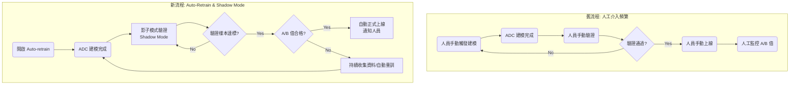

# AIADJ 模型訓練演進 (v2.0)

## 1. 背景與現況

### 系統架構
AIADJ 系統目前採用 **YOLO (檢測)** 結合 **EfficientNet v2s (ADC 分類)** 的雙模型架構。
*   **YOLO**: 負責初步檢測缺陷。
*   **ADC**: 針對 YOLO 檢出的缺陷區域進行二次分類，以提升濾除率並降低人員複判負擔。
*   **輔助工具**: Image picker (自動收集建模圖)、Auto labeling tool (降低標註負擔)。

### 原有流程痛點
原本 ADC 建模與上線流程高度依賴人工介入（Human-in-the-loop）：
1.  **人工觸發建模**: 人員需手動選擇 YOLO 模型並啟動 ADC 建模。
2.  **人工小量驗證**: 建模後，人員需手動進行測試。
3.  **人工決策上線**: 驗證無誤後手動上線，並持續人工監控 A (漏放率) / B (濾除率)。
4.  **人工迭代**: 若效果不佳，需人工重新收集圖片、重新建模。
*   **缺點**: 流程中斷點多，依賴人員經驗，迭代週期長，難以規模化。

## 2. ADC 自動訓練驗證流程改善 (Auto-Retrain)

### 新流程說明
引入 **Auto-Retrain** 機制，將「驗證」與「迭代」自動化，並透過 **Shadow Mode (影子模式)** 降低上線風險。

1.  **自動化啟動**: 提供 Auto-retrain 選項，勾選後系統自動銜接建模、驗證與部署步驟。
2.  **影子模式驗證 (Shadow Mode)**:
    *   ADC 建模完成後自動進入驗證階段。
    *   此階段 **AI 判斷僅供紀錄，不執行過濾**，所有圖片仍由人工檢測。
    *   系統背景自動比對「AI 預測結果」與「人工檢測答案 (Defect file)」。
3.  **自動評估與決策**:
    *   當累積驗證樣本數達建模張數的 1/10 時，系統自動計算 A/B 值。
    *   **情境 A (達標)**: 若 A/B 值達到設定標準 (例：A < 5% 且 B > 50%)，系統**自動正式上線** ADC 模型並即時通知相關人員。
    *   **情境 B (未達標)**: 系統持續收集 AI 答錯的樣本 (Hard Examples)，並視需求通知人員介入，或累積足夠資料後觸發新一輪自動訓練。

### 未來規劃：人工仲裁機制
*   當步驟 3 未達標時，提供視覺化介面供人員進行「差異判定」：
    *   **AI 誤判**: 系統將這些樣本自動加入標註庫，重新啟動 ADC 建模。
    *   **人工誤判**: 若因人員判定錯誤導致 AI A/B 值不準確，人員可選擇「強制上線」。

## 3. 流程演進對比

